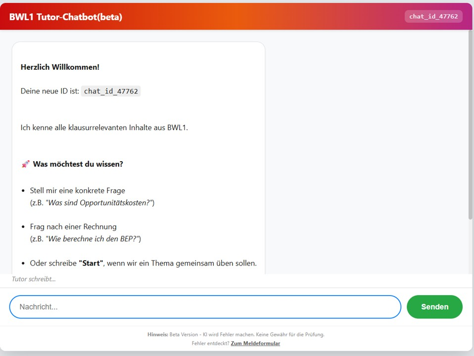
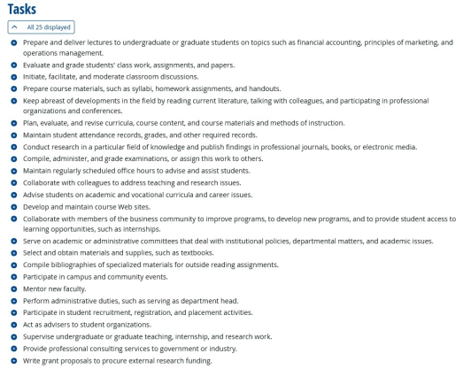
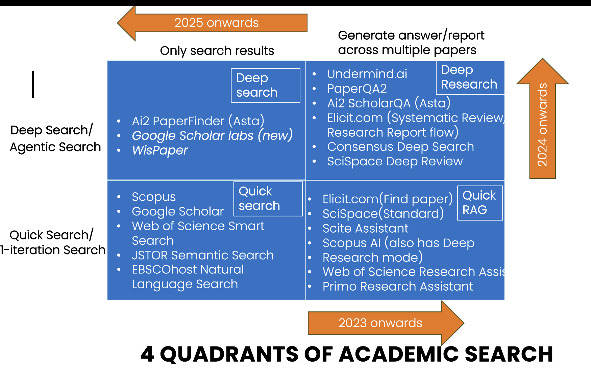
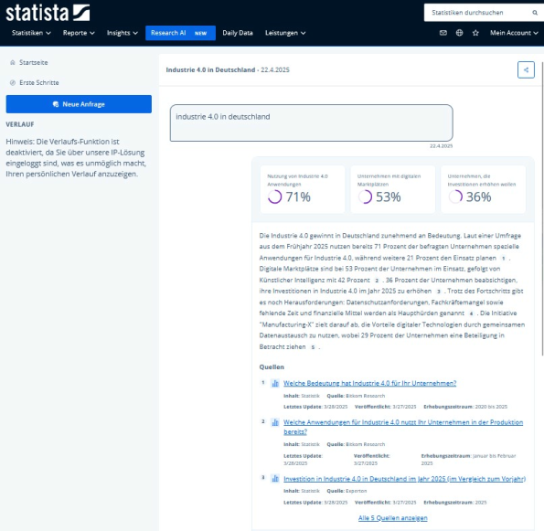
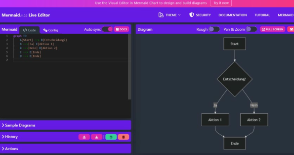
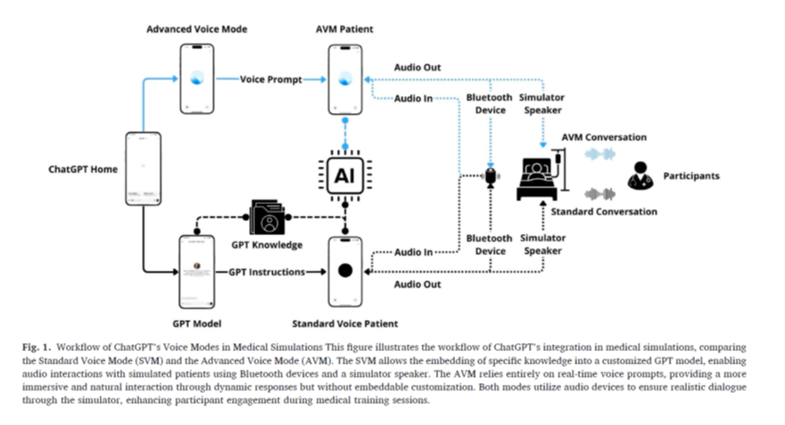

# Vier Szenarien der Nutzung von GenAI: Hiwi, Tutor, Copilot, Simulator {#sec-szenarien}

Wie nutzen Lehrende generative KI?
Wir sortieren die sehr vielfältigen Hilfestellungen der neuen Tools in vier Kategorien von Anwendungen: Hiwi, Tutor, Copilot, Simulator [@mollick2023a; @mollick2024a].

Hier ein aktuelles Beispiel für einen Tutor-Bot, den wir gerade als Hilfestellung für das Modul "Grundlagen der BWL" ausprobieren:

{#fig-tutor-bot-bwl}

**Hier können Sie die Live-Version testen:** https://dev.d1czie2npcfbfs.amplifyapp.com

## KI als Hiwi {#sec-hiwi}
### Was sind unsere Aufgaben?

Beschäftigte in Forschung und Lehre erfüllen eine Vielzahl sehr heterogener Aufgaben, mit einem wachsenden Teil an „Verwaltung“.
Wer lehrt, merkt schnell, dass die Präsenzveranstaltung nur die Spitze eines ganzen Eisbergs an Aufgaben darstellt.
Eine Umfrage unter Lehrenden in Österreich zeigt, dass sie etwa ein Drittel ihrer Zeit mit Lehraktivitäten verbringen (32 %) und etwa ein Fünftel mit Verwaltungstätigkeiten in der Hochschule (20 %) sowie ein weiteres Fünftel mit externen Verpflichtungen wie Gutachten oder Tätigkeiten in wissenschaftlichen Gesellschaften (9 %, 10 %) [@oesterreichischeruniversitaetsprofessor/innenverband2018].
Wie Unkraut im Garten wächst der Anteil, den Lehrende mit „sonstigem“ verbringen: Vor allem der Zeitaufwand für Verwaltung stieg an [@schomburg2012].

Woraus besteht das im Detail und wo könnten LLMs helfen?
Vor- und Nachbereitung, Evaluation, Beratung, Planung und vieles mehr lassen die Stunden eines Tages schnell vergehen.
@fig-onet-tasks zeigt die 25 Hauptaufgaben, die Lehrende nach Umfragen des US-Arbeitsministeriums verrichten (https://www.onetonline.org/link/summary/25-1011.00).
Welche Auswirkungen können wir von LLM auf diese konkreten Aufgaben erwarten?

{#fig-onet-tasks}

Historische Studien zeigen, dass Technologie typischerweise **Tätigkeiten** (tasks) beeinflusst und eher selten ganze Jobs ersetzt.
Führend sind dazu Untersuchungen von David Autor und dem Nobelpreisträger Daron Acemoglu [@acemoglu2019; @autor2015].
Eine nützliche Kategorisierung unterscheidet **drei Effekte** neuer Technologien auf den Faktor Arbeit: Technologische Veränderungen können menschliche Arbeit ersetzen (**Verdrängungseffekt** / displacement effect), spezifische Arbeitskräfte produktiver machen (**Produktivitätseffekt** / productivity effect / augmentation), oder neue Aufgaben (und Jobs) schaffen (**Wiedereinsetzungseffekt** / reinstatement effect) [@acemoglu2019].

| Effekt | Beschreibung | Aufgaben in der Lehre (Beispiele) |
|:-----------------------|:-----------------------|:-----------------------|
| **Verdrängung** | Technologie übernimmt Aufgaben | • Erstellung, Durchführung und Bewertung von Prüfungen (x) • Verwaltung von Noten und Anwesenheit (x) • Vorbereitung standardisierter Lehrmaterialien (x) • Zusammenstellung von Bibliographien (x) |
| **Produktivität** | Technologie macht Arbeit effizienter | • Vorbereitung und Durchführung von Vorlesungen (x) • Durchführung von Seminaren und Diskussionen (x) • Akademische und berufliche Beratung (?/x) • Forschung und Publikation (x) • Pflege von Webseiten und digitalen Ressourcen (?/x) |
| **Wiedereinsetzung** | Technologie schafft neue Aufgaben | • Entwicklung KI-gestützter Lehrkonzepte (x) • Qualitätskontrolle von KI-Materialien (x) • Gestaltung individueller Lernpfade (x) • Ethische und rechtliche Begleitung (x) • Weiterbildung des Personals (x) |

: Für welche Aufgaben in der Lehre erwarten wir Verdrängung und Erhöhung der Produktivität und welche Aufgaben kommen hinzu? Legende: x = klarer Effekt, ? = gemischter Effekt. Quelle: Theorierahmen nach @acemoglu2019 {#tbl-acemoglu}

In @tbl-acemoglu übertragen wir die genannten drei Effekte auf konkrete Aufgaben in der Hochschullehre.

Der **Verdrängungseffekt** betrifft hauptsächlich administrative und stark standardisierte Tätigkeiten.
Aufgaben wie das Erstellen, Durchführen und Bewerten von Prüfungen, die Verwaltung von Noten und Anwesenheiten sowie die Vorbereitung standardisierter Lehrmaterialien oder Literaturzusammenstellungen werden voraussichtlich vollständig oder überwiegend von KI übernommen.
Anwendungsstudien und Umfragen der letzten zwei Jahre geben hierzu deutliche Hinweise [@morgan2024; @naddaf2025; @ogunleye2024; @ou2024; @tutton2025].

Der **Produktivitätseffekt** bezieht sich auf zentrale Lehr-, Forschungs- und Betreuungstätigkeiten, die durch KI effizienter werden.
Dazu zählen die Vorbereitung und Durchführung von Vorlesungen, Seminaren und Diskussionen, akademische und berufliche Beratung der Studierenden sowie Forschung und Publikationen.
KI unterstützt hier durch automatische Literaturauswertungen, personalisierte Lerninhalte oder Pflege digitaler Ressourcen, sodass Lehrende ihre Kernaufgaben besser und effektiver erfüllen können [@gottweis2025; @meincke2024; @mollick2024a; @mollick2023b; @schwarcz2025].

**Gemischte Effekte** treten bei einigen Aufgaben wie der Entwicklung und Pflege von Kurswebseiten, dem digitalen Aufzeichnen von Vorträgen und der Auswahl von Lehrmaterialien auf, bei denen KI sowohl Teile der Aufgaben ersetzt als auch deren Durchführung produktiver macht.

Der **Wiedereinsetzungseffekt** zeigt, dass durch den Einsatz von generativer KI gänzlich neue Aufgaben entstehen.
Dazu gehören beispielsweise die Entwicklung neuer KI-gestützter Lehrkonzepte und -methoden, Qualitätskontrollen von KI-generierten Lehrmaterialien, Gestaltung individueller Lernpfade, ethische und rechtliche Begleitung des KI-Einsatzes sowie die Weiterbildung des Lehrpersonals im Umgang mit KI-Technologien [@dihan2025; @mollick2024; @mollick2024a].

Durch diese differenziertere Analyse der drei Effekte wird klar, dass die Einführung von KI in die Lehre zwar mit hoher Sicherheit **deutliche Änderungen im Aufgaben-Mix** und der Zeitanteile bedeutet, die wir mit verschiedenen Aufgaben verbringen.
Das ist nicht neu: Wer bestellt heute noch regelmäßig per Fernleihe, schickt Briefe oder kopiert in großem Umfang?
Wir sehen, dass generative KI wahrscheinlich mittelfristig einen Teil der aktuellen Tätigkeiten verdrängen, zentrale Kernaufgaben produktiver gestalten und zugleich neue, spezialisierte Aufgaben in der Lehre schaffen wird.

Ob das **insgesamt zu einer Zeitersparnis führt, ist keineswegs sicher**, denn die neuen Aufgaben um die Einrichtung und Betreuung der KI-Unterstützung können sehr zeitintensiv sein, als Beispiel sei hier etwa die Einrichtung eines Physik-Tutor-Bots [@kestin2024] oder einer Startup-Simulation, in der KI in verschiedenen Rollen beim Aufsetzen und Verbessern von Geschäftsplänen hilft [@mollick2024].
Beide Konzepte führen sichtlich zu einer Verbesserung der Lehre, aber die gibt es auch hier nicht umsonst.

### Fachartikel finden und auswerten: Wo setzen die KI-Helfer an und wie gut klappt das aktuell?  {#sec-recherche}
Was leisten die LLM-Helfer bei der Recherche? Aaron Tay von der Singapore Management University (SMU) liefert hierzu sehr gute Zusammenfassungen aus der Perspektive eines Bibliothekars und mit detaillierten Anwendungstests der Tools (https://aarontay.substack.com/) [@tay2025agentic].
Einige praktische Unterscheidungen und Erkenntnisse fassen wir hier kurz zusammen.

Welche Helfer tun was? Zwei Unterscheidungen helfen, hier einen Überblick zu bewahren: (1) Wird einmalig gesucht, oder in mehreren iterativen Schleifen? (**einmalige Suche vs. agentbasierter Suchprozess**. (2) Werden nur Ergebnisse aufgelistet, oder auch Inhalte der Fachartikel zusammengefasst (**Ergebnisliste vs. RAG-basierte Analyse**) [@tay2025agentic]?

| Retrieval | Output | Tay’s Bezeichnung | Beispiele (Anbieter/Produkt) | Was du praktisch bekommst |
|---|---|---|---|---|
| One-Shot | Liste | Quick Search | **Scopus**, **Lens.org**, **JSTOR Semantic Search**, **Web of Science Research Assistant**, **Google Scholar** | Eine klassische Trefferliste (lexikalisch/BM25, semantisch oder hybrid) mit Ranking, ohne generierten Antworttext. |
| One-Shot | Zusammenfassung | Quick RAG | **Primo Research Assistant**, **Scite Assistant**; außerdem als typische „answers-with-citations“-Beispiele: **Elicit**, **Consensus** | Kurze „Antwort mit Zitaten“, erzeugt aus den Top-Treffern; meist wenige Absätze. |
| Iterativ | Liste | Deep Search | **AI2 Paperfinder (Asta)**, **Scholar Labs** | Mehrere Iterationen über Minuten: Query-Variationen, semantische Suche, ggf. Citation-Chasing; ein LLM wirkt als Relevanz-Richter fürs Re-Ranking; Output bleibt eine Liste, aber typischerweise eine bessere. |
| Iterativ | Zusammenfassung/Report | Deep Research | **Undermind**, **Elicit Reports**, **Consensus Deep Search** | Deep Search plus Report-Generierung: längere Synthese/Literatur-Report auf Basis eines iterativ gefundenen Korpus. |

Einige Beispiele, welche Anbieter das jeweils meint, finden sich in der folgenden Abbildung.

{#fig-paper-discovery-types} \

Eine weitere Unterscheidung schaut tiefer auf die Art der Iteration [@tay2025agentic]: Nicht nur, ob ein Tool iteriert, sondern **wie es iteriert – ob es im Kern ein fest verdrahteter Workflow** mit ein paar „AI-Entscheidungspunkten“ ist (handcrafted) oder ob es **flexibel Aufgaben zerlegen kann**, die nicht in das Template passen. Tay beschreibt hier ein **„Agency-Spektrum“** und argumentiert, dass viele akademische Deep-(Re)Search-Tools eher am handwerklich-templatisierten Ende sitzen: beeindruckend innerhalb ihrer Schablonen, spröde außerhalb, mit dem Risiko, plausibel klingende Ergebnisse zu liefern, obwohl die Aufgabe gar nicht sauber gelöst wurde [@tay2025agentic]. Sein Stresstest ist dabei sehr sozialwissenschaftlich gedacht: „Finde Arbeiten, die Paper X hätte zitieren sollen, aber nicht zitiert.“ Ein menschlicher Hiwi zerlegt das in Schritte (ähnliche Arbeiten finden; Referenzen extrahieren; Überlappung abziehen). Tay berichtet, dass allgemeine LLMs diese Logik eher ausführen können, während spezialisierte „deep“ Tools teilweise scheitern, weil die Aufgabe nicht zum eingebauten Ablauf passt [@tay2025agentic].

Tay argumentiert, dass die **Kurzversion** der Antwort „Answer-with-citations“ für akademische Arbeit oft nur ein Teaser und kaum verwendbar ist. Man **braucht den Originaltext für Kontext, Nuancen, Operationalisierung und Identifikationslogik**; und generierter Text kann Quellen falsch „anbinden“ (**source faithfulness“**), also etwas behaupten, das der zitierte Text so nicht trägt [@tay2025agentic]. In sozialwissenschaftlicher Praxis trifft das besonders (a) kausale Claims (Identifikation, Robustheit, Messvalidität) und (b) qualitative Inferenz (Sampling-Logik, Positionsgebundenheit, Geltungsgrenzen), weil die entscheidenden Stellen häufig nicht im Abstract stehen und disziplinierte Lektüre verlangen.

**Gefundene Ergebnisse verdichten und Fachartikel zusammenfassen** - was können die KI-Helfer hier aktuell leisten?
Wir folgen hier einer Gliederung der KI-Helfer nach der Funktion [@tay2024classifying]: Bieten sie an, einmal ein einzelnes Dokument zu verdichten oder mehrfach ein einzelnes? Eine dritte Option ist eine Literatur-Synthese über mehrere Dokumente. Aus diesen Unterscheidungen von einfacher oder sequenzieller Durchführung und fokussierter vs. übergreifender Synthese ergeben sich folgende Ausprägungen, die wir hier je kurz mit Beispielen erläutern [@tay2024classifying]:

| Form der LLM-Zusammenfassung (Tay) | Was passiert technisch/funktional? | Typische UI-Form | Beispiele (Anbieter/Produktnamen) | Nutzen in sozialwissenschaftlicher Forschung | Typische Risiken und worauf man testet |
|---|---|---|---|---|---|
| **1. Single-Document Summarisation** (ein Dokument) | Ein einzelner Text wird zusammengefasst; Tay unterscheidet innerhalb dieser Kategorie drei Varianten je nach Prompt-Freiheit: (1a) fester Button, (1b) feste, aber query-abhängige Antwort, (1c) freies Q&A/Chat über ein Dokument. Viele Implementierungen nutzen intern RAG-Muster und zeigen „Snippets“ als Beleg. | Button/Sidebar/Chat neben einem Treffer | **1a**: EBSCO „AI Insights“; **1a**: Ex Libris „Document Insights“ (Primo/ProQuest-Kontext); **1b**: ProQuest „Research Assistant“ (z. B. „Relationship to your search terms“); **1c**: JSTOR Research Tool (beta) „Chat“. | Sehr gut fürs schnelle Triage-Lesen: „Ist das Paper relevant?“; hilfreich bei überlappenden Begriffen zwischen Soziologie/Politikwissenschaft/Erziehungswissenschaft. Query-abhängige Varianten (1b) machen sichtbar, wenn ein Treffer nur semantisch „ähnlich“ ist, aber nicht zur Fragestellung passt. | Bei festen Buttons geringeres Risiko, aber oft nur „aufgebohrte Abstract-Paraphrase“; bei Chat-mit-PDF höheres Risiko durch unvorhersehbare Fragen. Tests: Stabilität (gleicher Text → ähnliche Ausgabe), Grounding-Spotchecks (Behauptungen im PDF prüfen), Negativkontrolle („steht das überhaupt drin?“), Scope-Klarheit (Abstract vs. Volltext). |
| **2. Sequential Single-Document Summarisation** (mehrere Dokumente, aber jeweils einzeln) | Mehrere Treffer werden nacheinander dokumentweise verarbeitet; typisch sind „Synthesis tables“/Matrizen. Extraktion klar definierter Variablen ist meist zuverlässiger als freie Zusammenfassung. Query-abhängige Ein-Zeilen-Zusammenfassungen dienen nebenbei als Relevanz-Signal. | Tabelle/Matrix über Top-K Treffer | **Elicit**: automatische Summary-Spalte plus frei definierbare Extraktions-Spalten (Design, Sample, Outcome etc.). | „Codier-Werkbank“: Konstrukte, Kontext, Designlogik und Findings als Spalten definieren, Paper für Paper füllen lassen; macht Muster, Cluster und Ausreißer sichtbar (wie ein standardisiertes Codebuch mit beschleunigter Erstbefüllung). | Stille Inkonsistenzen: driftende Begriffe/Einheiten, „Missingness“ wird mit Vermutungen gefüllt. Tests: Stichproben-Audit gegen PDF, Konsistenzchecks, „Missingness-Ehrlichkeit“, Provenance je Zelle (Textstelle muss rückverfolgbar sein). |
| **3. Query-based Multi-Document Summarisation** (Synthese über mehrere Dokumente) | Synthese über mehrere Dokumente zur Beantwortung einer Frage; häufig RAG. Varianten: nur Suchtreffer, nur Uploads oder Hybrid. Manche Systeme fixieren zuerst ein Korpus (z. B. Top-25) und erlauben danach Folgefragen über dieses Set. | „Answer with citations“ / Report über mehrere Papers | **Ex Libris/Primo Research Assistant**; **Google NotebookLM** (Upload-Korpus); **Elicit Systematic Review** (Hybrid); **JSTOR Research Tool (beta)** (fixes Top-K-Set); **Undermind.ai** („Ask Expert“) nach iterativer Phase. | „Narrativ-Maschine“: gut für Landschaftsskizzen (Themencluster, Mechanismen, Kontroversen). Kann beim Strukturieren eines Review-Kapitels helfen (Abschnitte nach Mechanismen, Kontexten, Messansätzen). | Höchstes Fehlerrisiko durch Kombination aus Retrieval-Fehlern, kontextuntreuer Paper-Zusammenfassung und schwacher Evidenzgewichtung. In Sozialwissenschaften heikel wegen heterogener Designs. Tests: Claim-zu-Quelle-Mapping, Coverage („Must-cite“-Set), Widerspruchstest, „Not in sources“-Test, Retraktions-/Korrekturtest. |

: Paper mit KI analysieren: Einfach oder sequenziell, ein Artikel oder Synthese mehrerer Artikel? Quelle: @tay2024classifying {#tbl-paper-analysis-types}

**Entsprechen die spezialisierten Angebote wirklich menschlichen Hilfskräften?** Noch eher nicht im Sinne dass sie flexibel und autonom agieren. Für einzelne Teilaufgaben ist der Anspruch eher erfüllt. Der Bibliothekar Tay führt hierfür einen Stresstest durch, er promptet eine komplexe Aufgabe, für die mehrere Schritte flexibel angepasst werden müssten: „Finde Arbeiten, die Paper X hätte zitieren sollen, aber nicht zitiert.“ Ein menschlicher Hiwi zerlegt das in Schritte (ähnliche Arbeiten finden; Referenzen extrahieren; Überlappung abziehen). Tay berichtet, dass allgemeine LLMs diese Logik eher ausführen können, während spezialisierte „deep“ Tools teilweise scheitern, weil die Aufgabe nicht in ihren eingebauten Ablauf passt [@tay2025agentic].

Ein **Problem** der meisten o.g. spezialisierten Such-Tools ist, dass sie **nicht hinter den Paywall der akademischen Verlage kommen** und daher nur auf Open-Access-Korpora oder Abstracts zugreifen. 

Neue Verbindungen geben hier **Hoffnung, dass man zukünftig Suchstrategien direkt mit dem Sprachmodell anpassen kann**: Neben verlagseigenen Angeboten wie Scopus AI (Elsevier) bieten **akademische Konnektoren** zu den großen Sprachmodellen wie Claude eine interessante **neue Möglichkeit**. Der zentrale Punkt ist nicht das Umgehen von Paywalls, sondern lizenzkonformer Zugriff über institutionelle Authentifizierung: Ein allgemeines LLM (z. B. Anthropics Claude) bleibt unverändert, erhält aber über einen Connector einen standardisierten Zugriff auf akademische Datenquellen, deren Volltexte sonst außerhalb des Modells liegen. Damit verschiebt sich die Arbeit von „Abstract-basiertem Raten“ zu „passagenbasiertem Prüfen“ – bei gleichzeitiger Begrenzung auf den jeweiligen Content-Pool des Anbieters (z. B. Wiley) [@tay2024mcp].

Für sozialwissenschaftliche Workflows entstehen daraus **drei konkrete Nutzenmuster.** Erstens wird Discovery belastbarer, weil Suchläufe nicht nur aus generierten Suchstrings bestehen, sondern **als echte Datenbankabfragen ausgeführt und iterativ nachjustiert** werden können; das **reduziert die typische Lücke zwischen „schöner Suchsyntax“ und realer Trefferlandschaft** [@tay2024mcp]. Zweitens wird das **„source-faithfulness“-Problem eingehegt**, weil Antworten stärker an konkrete Volltextpassagen gebunden werden können (RAG über lizenzierte Inhalte); Behauptungen lassen sich damit schneller an Fundstellen prüfen, statt nur auf Abstract-Ebene zu verbleiben [@tay2024mcp]. Drittens **steigt die Dokumentierbarkeit**: Connector-basierte Abläufe machen die Kette aus Frage → Abfrage → Treffer → Passagen sichtbarer und damit eher anschlussfähig an methodische Anforderungen von Reviews (Transparenz, Nachvollziehbarkeit, Audit-Pfad) [@tay2024mcp].

Die **Grenzen** bleiben klar: Der Zugriff ist auf die abgedeckte Plattform beschränkt (kein „universeller“ Volltextzugang), und die Retrieval-Einheit ist häufig chunk-basiert statt „ganzer Artikel am Stück“. Der Zugewinn liegt daher weniger in fertigen Synthesen als in kontrollierterem Zugriff und in der Verlagerung von KI-Unterstützung auf die Stellen, an denen klassische Workflows typischerweise scheitern: Paywall-Blindheit, schwer prüfbare Zusammenfassungen, und geringe Reproduzierbarkeit von generativen Retrieval-Schritten [@tay2024mcp].

## KI als Copilot {#sec-copilot}

In dieser Kategorie hilft das Sprachmodell uns dabei, etwas zu tun, was wir sonst nicht könnten.
@mollick2024a beschreiben mehrere solcher Ansätze: Bei der **"Case Co-Creation"** [@mollick2024a, S. 25–28] arbeiten Studierende mit der KI zusammen, um ein Fallbeispiel für Kommilitonen zu erstellen.
Dies fördert die Artikulation von Ideen und die kritische Auseinandersetzung mit dem KI-Output, da die initialen Entwürfe oft oberflächlich sind und durch studentische Expertise verbessert werden müssen.
Die Übung **"Critique the AI"** lässt die KI ein Szenario zu einem Konzept (z. B. Groupthink) erstellen, das die Studierenden dann kritisch bewerten und ggf.
verbessern müssen.
Dies schult das Erkennen von Konzeptmerkmalen und die Fähigkeit, Wissen durch Korrektur zu artikulieren.
Eine Herausforderung ist, dass die KI Konzepte manchmal unvollständig oder fehlerhaft illustriert, was aber Teil des Lerneffekts sein kann [@mollick2024a].

### Besser schreiben – als Cyborg {#sec-cyborg-writing}

Wer akademisch schreibt, lässt sich zunehmend von einer Vielzahl an unterstützenden KI-Systemen über die Schultern schauen – oder die Hand führen –, die Vorschläge zur besseren Sprachverwendung machen, wie DeepL, Grammarly, oder ChatGPT [@ou2024].
@ou2024 sprechen von AI-assisted language tools (AILT), die Studierenden dabei helfen, ihre Sprachfähigkeiten etwa von einer in die andere Sprache zu übertragen und das Sprachniveau ihrer Schreibprodukte generell zu verbessern.
In ihrer Studie analysieren sie die Kommentare von 1703 schwedischen Studierenden und stellen komplexe Muster der Nutzung fest: „…students align their own languages, writing skills and thinking with the algorithm-based language processes (e.g., lexical, grammatical, and textual corrections, word choice suggestions, language translation) within AI chatbots, writing assistance, and machine language translation to optimise the outcomes of their academic writing.
… students have become ‘spatially extended cyborg\[s\]’”.

Studierende schreiben durch die zunehmend mächtigere technische Unterstützung ihre Haus- und Abschlussarbeiten deutlich anders.
Bedeutet dies das Ende der Hausarbeit?
Wohl eher einen starken Wandel, denn es wird weiter wichtig sein, die saubere Argumentation zu üben [@friedrich2023; @klein2023].

::: {.callout-tip title="Probieren Sie mal"}
Hier haben wir einen kleinen **Schreib-Trainer-Bot für Studierende** erstellt, der ihnen dabei helfen soll, eine **Einleitung für die Abschlussarbeit** zu schreiben.
Dabei werden zunächst Beispiele gezeigt die nach richtig/falsch sortiert werden müssen, dann kommen nach und nach komplexere Fragen: [Link zum Einleitungstrainer](https://chatgpt.com/g/g-68767cb33afc8191b1cfb9da1ed5c15a-bot-1-einleitungstrainer)

Hier eine zweite Übung (erstellt von Julia Schmid), zum die strukturiertes **Schreiben mit Einleitungssätzen (Topic-Sentences)** beibringen soll: [Link zum Topic-Sentence-Bot](https://chatgpt.com/g/g-68768c3031c08191b752ef66df258979-topic-sentence-bot).
:::

Die Studienberatung der Universität Frankfurt hat eine Übersicht nach Phasen des Prozesses erstellt [@lehrevirtuell-universitaetfrankfurt2023], s.
@tbl-writing-process:

| Phase im Schreibprozess | Unterstützung durch KI | Eigenanteil |
|:-----------------------|:-----------------------|:-----------------------|
| **Themenfindung und Literaturrecherche** | Brainstorming Grober Themenüberblick | Schwerpunktsetzung Wissenschaftliche Quellen finden |
| **Lesen und Exzerpieren** | Zusammenfassung/Gliederung für ersten Überblick Textpassagen vereinfachen | Gründliches Lesen KI-generierte Texte überarbeiten |
| **Rohfassung** | Ausformulieren von Stichpunkten Kooperatives Freewriting | Stichpunkte festhalten "Schreiben, um eigene Gedanken zu klären" KI-generierte Texte überarbeiten |
| **Überarbeiten** | Verschiedene Textversionen generieren Stil/Perspektive anpassen | Passende Textversion aussuchen und anpassen Menschliches Feedback einholen |
| **Sprachliche Korrektur** | Spezialisierte Tools wie DeepL, Write und Duden Mentor | Prüfen, ob Bedeutung verändert wurde |

: Integration von KI in den Schreibprozess. Quelle: Studienberatung der Universität Frankfurt [@lehrevirtuell-universitaetfrankfurt2023], Stand 10.3.2024 {#tbl-writing-process}

Mit einer einfachen Skala lässt sich auch die Intensität der LLM-Nutzung grob beschreiben.
(s. @tbl-llm-scale): Je nach Phase im Arbeitsprozess kann LLM zur Ideenfindung, zur Ausarbeitung möglicher Fragestellungen oder Inhalte dienen.
Je nach Intensität sollte dann die Nutzung stärker begründet und durch Prüfschritte abgesichert werden [@baresel2024a; @rowland2023].

| Grad der KI-Nutzung | Charakterisierung | Beispiele |
|:-----------------------|:-----------------------|:-----------------------|
| **1** | **Zur Inspiration** | Sie haben sich Vorschläge für Themen unterbreiten lassen; Tools eingesetzt, um sich aus eigenen Notizen heraus Themenschwerpunkte zu bilden; sich Formulierungen vorschlagen lassen; die Rechtschreibung-/Grammatikprüfung genutzt. |
| **2** | **Ergänzend** | Sie haben sich mögliche Fragestellungen vorschlagen lassen, einzelne Begriffe der Aufgabenstellung oder Stellen in der Literatur erklären lassen, Gliederungen der eigenen Notizen vorschlagen oder eigene Texte zusammenfassen lassen, Reverse Outline zum eigenen Text (eine basierend auf dem Geschriebenen erzeugte Gliederung) generieren lassen. |
| **3** | **Unterstützend** | Sie haben sich Anforderungen der Aufgabe (z. B. Aufbau einer HA) erklären, Literatur zusammenfassen, mögliche Gliederungen zum Thema vorschlagen lassen;  Sie haben die Fragestellung dialogisch verfeinert bzw. Textteile dialogisch verfasst und dabei LLM-Output iterativ ergänzt;  Sie haben sich Überarbeitungsvorschläge bzgl. Leserlichkeit und Stil generieren lassen. |
| **4** | **Inhaltsgestaltend** | Sie haben sich Hintergrundwissen zur Aufgabe bzw. Antworten auf Fragestellung generieren, Gliederung zum Thema vorgeben, Kürzungen und Ergänzungen vornehmen lassen oder KI-generierten Text direkt übernommen. |

: Erläuterungen zum Grad der LLM-Nutzung. Quelle: @baresel2024a, basierend auf @rowland2023 {#tbl-llm-scale}

Wie können wir konstruktiv mit den neuen technischen Möglichkeiten umgehen?
Die folgende Tabelle fasst konkrete Beispiele für Hausarbeiten unter Einbindung von KI zusammen, die Ethan und Lilach Mollick in verschiedenen Beiträgen ausgeführt haben [@mollick2023b; @mollick2023h].
Der übergeordnete Gedanke ist, KI nicht nur zur Automatisierung einzusetzen, sondern neue, interaktivere und individuellere Lernerfahrungen zu ermöglichen – mit mehr Reflexion, verschiedenen Perspektiven, Kreativität und Kollaboration.
Die Rolle der Lehrenden wandelt sich hin zur Begleitung und Moderation dieser KI-gestützten Prozesse.

| Ansatz | Beschreibung |
|:-----------------------------------|:-----------------------------------|
| **Copilot: Kollaboratives Schreiben mit KI** | Gruppen von Studierenden schreiben gemeinsam einen Text und nutzen KI als zusätzliches "Teammitglied". Sie dokumentieren die Interaktion mit KI und reflektieren Vor- und Nachteile. |
| **Copilot: Multimediale Anreicherung mit KI** | Studierende nutzen KI, um ihre Arbeiten mit Visualisierungen, Animationen oder Audio anzureichern und reflektieren, wie dies Verständnis und Attraktivität erhöht. |
| **Copilot: KI als Coach und Reflexionspartner** | KI stellt Fragen bezogen auf die Teamarbeit, um Studierende zur Reflexion ihrer Lernerfahrungen, Herausforderungen und Lehren anzuregen. |
| **Tutor: KI-generierte Beispiele zur Erklärung von Konzepten** | KI erstellt schnell viele Beispiele, die ein abstraktes Konzept in unterschiedlichen realen Kontexten illustrieren. Dies hilft Studierenden, die Idee zu erfassen und breiter anzuwenden. |
| **Tutor: KI-Tutor, den Studierende kritisieren** | KI erstellt einen Essay zu einem Thema, den Studierende dann kollaborativ verbessern, indem sie Informationen ergänzen, Punkte klären, Belege liefern etc. Fördert kritische Analyse. |
| **Tutor: Simulation von Anwendungsszenarien mit KI** | Besonders in praxisorientierten Fächern erstellen Studierende mit KI Simulationen, in denen sie ihre Erkenntnisse anwenden, z. B. Unterrichtsszenarien in der Lehramtsausbildung. |

: Neue Ansätze für Hausarbeiten mit KI. Quelle: @mollick2023b sowie die verlinkten Blogeinträge {#tbl-mollick-assignments}

Prompts für ausgewählte Anwendungen finden Sie im Appendix.

Letztlich ist die Anpassung der didaktischen Ansätze und technischen Möglichkeiten auf die konkrete Kombination von Lerninhalt und Studierendengruppe entscheidend. Es besteht die **Hoffnung**, dass die neuen Möglichkeiten der **administrativen Entlastung, höheren Niveaus bei Arbeitsaufgaben und schnellerer Individualisierung der Lernunterstützung** in der Summe zu einem höheren Niveau des Lehrens und Lernens führt.

**Voraussetzung** dafür ist sicherlich eine **Anpassung der Lehrstrategie** und die nüchterne und proaktive Beschäftigung mit den unvermeidlichen Risiken und Nebenwirkungen von neuen technischen Möglichkeiten.
Wie kann kritisches Denken in diesen neuen Recherche- und Schreibprozessen erfolgen [@lee2025]?
In diesem Fall darf man vermuten, dass die negativen Effekte noch höher wären, wenn wir die Lehre nicht anpassen.

Wie der nächste Abschnitt zeit, findet aktuell eine ähnlich intensive Diskussion findet im Bereich der Informatik statt, wo speziell Programmieraufgaben ganz neu gedacht werden müssen.

### Jeder kann jetzt programmieren {#sec-coding}

Mit KI als Copilot können wir **viel umfangreicher und schneller mit Code arbeiten**. Ein Beispiel ist Programmieren: Professionelle Programmierer werden mit KI-Copiloten deutlich schneller [@peng2023; zunehmend beaufsichtigen sie KI-Agenten, siehe etwa @willison2025; @steinberger2025] und Lehrbücher haben zunehmend Namen wie „Learn AI-assisted Python Programming“ [@porter2024].

Studierende können so zum Beispiel viel schneller ein funktionierendes Spiel oder eine Simulation erstellen, was die Motivation erhöht. Der **Raum der kreativen Möglichkeiten weitet sich deutlich aus**.
Mit KI-Unterstützung können Schüler/innen mit Sonic Pi Musikstücke programmieren [@gieselmann2024] oder mit Tools wie Violentmonkey kleine Skripte für die individuelle Anzeige von Lieblings-Websites erstellen [@eikenberg2025].

Wie helfen solche Copiloten beim Coden? Aktuelle Studien untersuchen etwa, wie man mit KI-Copiloten auch Nicht-Informatiker an fortgeschrittene statistische Auswertungen heranführen kann [@bien2025].
In einer Einführungsvorlesung für **MBA-Studierende** wurde GitHub Copilot genutzt, wobei die Studierenden natürliche Spracheingaben verwendeten, um **R-Code automatisch** generieren zu lassen.
Das Ziel war, komplexe Syntax zu vermeiden und die Studierenden direkt mit Datenanalyse vertraut zu machen.
Im Ergebnis ermöglichte die Nutzung von GitHub Copilot es Studierenden ohne Programmierkenntnisse, statistische Methoden effektiv und eigenständig anzuwenden.
Studierende bewerteten die Nutzung der KI-Tools überwiegend positiv, da diese die Lernerfahrung verbesserten und den Zugang zur Programmierung erleichterten.
Die empirische Untersuchung zeigte, dass ein Großteil der universitären Programmieraufgaben teilweise oder vollständig durch die KI-Tools gelöst werden konnte.

Eine weitere Studie sammelt qualitative Erfahrungen in einem **Einführungskurs in Informatik**, wie sich die Nutzung von Copilot auf das Lernen auswirkte [@puryear2022].
Studierende profitierten deutlich von Copilot, insbesondere bei der Entwicklung von Programmierfähigkeiten und beim Lösen konkreter Programmierprobleme.
Allerdings zeigte sich, dass die Studierenden weiterhin ein fundiertes Verständnis der Programmiersprache benötigen, um KI-generierte Lösungen richtig beurteilen und gegebenenfalls korrigieren zu können.
Die KI unterstützte den Lernprozess effektiv, konnte aber die grundlegenden Konzepte nicht vollständig ersetzen.

Mehrere Studien testen, **wie gut ein KI-Assistent typische Programmieraufgaben** aus einer Einführungsveranstaltung löst – zunächst allein durch KI und dann mit Anpassung der Eingaben durch Studierende (GitHub Copilot) [@denny2023].
Eine öffentliche Datenbank mit 166 typischen CS1-Problemen wurde genutzt, um Copilot zu testen.
Wenn Copilot anfangs scheiterte, versuchten Studierende, die Beschreibung der Aufgaben in natürlicher Sprache anzupassen („Prompt Engineering“), um das Ergebnis zu verbessern.
Copilot löste etwa die Hälfte der Programmieraufgaben auf Anhieb korrekt.
Durch gezieltes Prompt Engineering konnten weitere 60 % der anfänglich nicht gelösten Aufgaben erfolgreich bearbeitet werden.
Dies deutet darauf hin, dass die bewusste Formulierung von Aufgabenstellungen ein wichtiger Bestandteil der Lernaktivitäten wird und das Erlernen von Programmierkompetenzen verändert.

Eine weitere Studie an der niederländischen Universität Twente zeigt basierend auf Interviews und Umfragen mit Studierenden, dass ein Großteil der universitären Programmieraufgaben teilweise oder vollständig durch die KI-Tools gelöst werden konnte.
Dies erfordert, dass Lehrende ihre Unterrichtsstrategien anpassen, um sicherzustellen, dass Kernkompetenzen dennoch vermittelt werden [@nizamudeen2024].

Wofür nutzen professionelle Programmierer\*innen die Copiloten?
Eine Studie untersucht dies mit einer Umfrage unter 410 Entwicklern [@liang2024].
Die wichtigsten Gründe der Nutzung waren Autovervollständigung, schnelleres Abschließen von Programmieraufgaben sowie Unterstützung beim Erinnern von Syntax.
Als besonders erfolgreich erwiesen sich die Tools bei repetitiven und einfachen Programmieraufgaben.
Häufige Probleme waren jedoch, dass generierter Code oft nicht die gewünschten funktionalen oder nicht-funktionalen Anforderungen erfüllte, wodurch Entwickler diesen oft modifizieren mussten oder ganz darauf verzichteten.

Alle fünf Studien zeigen, dass KI-Programmierassistenten, insbesondere GitHub Copilot, effektiv dabei helfen, **Einstiegshürden beim Programmieren zu reduzieren**, indem sie Entwicklern helfen, repetitive und einfache Programmieraufgaben effizienter zu erledigen [@bien2025; @liang2024; @nizamudeen2024; @puryear2022].
Ein wesentliches Potenzial dieser Tools liegt in der **Steigerung der Motivation und der Verkürzung der Lernkurve** bei Programmieranfängern.

Besonders wichtige neue Kompetenzbereiche sind „Prompt Engineering“, die gezielte Steuerung der KI-Ausgaben [@denny2023], sowie das Verständnis dafür, wie Input den generierten Output beeinflusst [@liang2024].
Jedoch treten auch **Herausforderungen** auf: Häufig erfüllen KI-generierte Lösungen nicht alle funktionalen oder nicht-funktionalen Anforderungen, weshalb Entwickler oft erhebliche Anpassungen vornehmen müssen oder den KI-generierten Code ganz verwerfen [@liang2024].
Dies unterstreicht, dass trotz erheblicher Erleichterungen durch KI grundlegende Programmierkenntnisse weiterhin notwendig sind, um Lösungen kritisch zu bewerten und effektiv anzupassen [@puryear2022].

**Praktisch alles, was Code ist, lässt sich mit Sprachmodellen erstellen und anpassen**.
Wir brauchen also nur Code-Schnittstellen.
Das klingt kompliziert, ist aber überall schon vorhanden.
Im Schreibprozess importieren wir Zitationen über das Bibtex-Format (.bib).
Kalendertermine werden im Kalenderstandard (.ics) geführt.
Für Flussdiagramme gibt es z.
B.
den Mermaid-Standard.
Wir können insofern mit Sprachmodellen:

-   Zitationen von einem Foto aus importieren („Scanne das Foto und gib mir die Quellen als Bibtex Code aus. Erkläre mir dann, wie ich ihn importiere“)
-   Kalendereinträge aus einer Liste in unser Terminprogramm überführen („Erstelle mir aus dieser Liste Einträge im ICS Standard. Erkläre mir dann, wie ich den Code in Google Calendar importiere.“)
-   Ablaufdiagramme in Mermaid visualisieren und als Grafik speichern („Erstelle mir einen typischen Kaufprozess in Mermaid. Erkläre mir dann, wie ich ihn visualisieren und als Grafik exportieren kann.“)
-   Interaktive Simulationen mit den Claude Artifacts erstellen (s. o.)
-   Dialogbasiert Grafiken und statistische Analysen in Google Colab erstellen (s. u.)
-   (Für viele weitere Ideen für solche Hilfsmittel können wir einfach das Sprachmodell fragen.)

{#fig-mermaid}

Wichtig für Hochschulen: Mit verschiedenen browserbasierten Tools wie **Google Colab oder Cursor** steht mittlerweile eine sehr mächtige Programmierhilfe mit integriertem Sprachmodell (Gemini) zur kostenlosen Verfügung.
Visualisierungen und statistische Analysen können hier komplett dialogbasiert begonnen werden.
Auch ohne Grundkenntnisse in der Programmiersprache Python sind Studierende hier gleich handlungsfähig und können durch häufige Nutzung Wissen aufbauen.
Dadurch wird es etwa möglich, von Studierenden durchgängig die Nutzung von Programmiertools zur Erstellung von Visualisierungen zu verlangen.
Die Hilfestellung durch die KI-Assistenz lässt dies deutlich leichter werden, als das händische Gefrickel in den Grafiken von Excel oder gar PowerPoint.
Zur Illustration hier ein Beispiel-Notebook.
Rechts können die Prompts eingegeben werden: [Beispiel-Notebook](https://colab.research.google.com/drive/1mFJWvghahGor87gwkNZAqPYoejD3KDwK?usp=sharing)

**Beispiel-Prompts:** \* Erstelle mir eine einfache Visualisierung von vertikalen und horizontalen **Balkendiagrammen** in Python.
\* **Passe die Balken so an**, dass die Prozentwerte auf den Balken sichtbar sind.
\* Füge Beispiele für **Violin Charts** mit einem etwas komplexeren **Beispieldatensatz** hinzu.
\* Erstelle jetzt einen Beispieldatensatz und führe eine einfache **Explorative Datenanalyse** (EDA) mit Visualisierungen durch.

{#fig-colab}

Anmerkung: Rechts schreibt man den Prompt, links entsteht der Code und die Grafik.
Besondere Stärken sind die Nachvollziehbarkeit (da alles im Code steht) und die einfachen Anpassungsmöglichkeiten (da die KI sich um die Syntax kümmert).
Code ist hier einsehbar: [Link zum Code](https://colab.research.google.com/drive/1mFJWvghahGor87gwkNZAqPYoejD3KDwK?usp=sharing).

Solche **Hilfestellungen sind mittlerweile Alltag** geworden: Alle großen Anbieter von Code-Editoren wie **Pycharm, VS Code (Microsoft/GitHub) und neue Anbieter wie Cursor** und (noch extremer, als Agent) **Devin** (https://preview.devin.ai/) bieten mittlerweile Programmierung mit KI-Unterstützung an.
Für Hochschulen stellt sich die Frage, wie diese Fähigkeit am Besten trainiert werden kann.
Ein extremes Anwendungsbeispiel ist dieser Youtuber, der in Trainingsvideos mit einer Vielzahl verschiedener KI-Tools programmiert, auch selbst beschrieben eher in der Rolle eines Supervisors, der die verschiedenen KI-Helfer überwacht und koordiniert: [Build Anything with Cursor, David Ondrej, 2024-09-1](https://www.youtube.com/watch?v=C59LC1WJIbE).

## KI als Tutor {#sec-tutor}

Diese Kategorie umfasst KI-Systeme, die Studierende direkt beim Lernen anleiten, beraten oder ihnen Feedback geben. Sogenannte Intelligent Tutor Systems (ITS) werden in der Didaktik schon länger diskutiert, sie wurden klassischerweise regelbasiert als Entscheidungsbäume aufgebaut, ähnlich einem Fortsetzungs-Kinderbuch (A la: "Wenn Du die Tür öffnen willst, lies weiter auf S.145" ). Durch generative KI entstehen breitere Möglichkeiten der Interaktion, jedoch führt das "generative" Element auch etwas Unsicherheit in die Dialogsteuerung ein [@latif2026systematic].

Aus didaktischer Sicht entfaltet der GenAI Tutor seinen Mehrwert vor allem in vier Punkten [@kestin2024]: \* **Individuelle Anpassung**: Das System erkennt unterschiedliche Lernstände (etwa durch Analyse typischer Fehler oder wiederkehrender Wissenslücken) und kann dadurch passgenauere Folgefragen stellen.
\* **Unmittelbares Feedback**: Während in großen Lehrveranstaltungen Lehrende nur sehr eingeschränkt auf einzelne Fragen von Studierenden eingehen können, liefert das KI-Tool praktisch sofort Rückmeldungen.
\* **Motivation und aktive Teilhabe**: Studierende werden durch die permanenten Interaktionsmöglichkeiten stärker einbezogen, was sich positiv auf die Lernergebnisse auswirkt.
\* **Zeitersparnis für Lehrende**: Ein Teil der individuellen Betreuung kann – bei inhaltlich gut vorbereitetem KI-System – durch den Tutor übernommen werden.
Allerdings behält die Lehrkraft jederzeit die Oberaufsicht, indem sie zum Beispiel relevante KI-Antworten stichprobenartig überprüft oder spezielle Fälle selbst übernimmt (z. B. wenn die KI Auskünfte gibt, die nicht zur jeweiligen Kursstruktur passen).

Generell ist bei KI-Tutoren die **Gefahr von Fehlinformationen und Halluzinationen** zu beachten.
Hierfür gibt es jedoch gute Gegenmaßnahmen, vor allem durch Kontrolle des Inputs und systematische Qualitätstests der LLM-Tools.
Eine interessante Möglichkeit, die beim Physik-Tutor der Harvard Studie besprochen wird [@kestin2024], ist die **Bereitstellung von Musterlösungen als Input** (nicht nur der Fragen), was die Gefahr von Ungenauigkeiten, Halluzinationen und Inkonsistenzen in den Antworten des Sprachmodells deutlich reduziert.
Der Aufwand für die Erstaufsetzung steigt hier zwar, aber im Gegenzug verspricht dieser Ansatz die Vorteile der individuellen Anleitung ohne die Nachteile der Qualitätsunsicherheit.
Insgesamt ist eine solche Durchsicht und intensive Qualitätskontrolle klar zu empfehlen (dieser Aspekt der intensiven Qualitätstests wird bei der Kurzvorstellung einiger deutscher Fallstudien in @wannemacher2025 vernachlässigt).

### Beispiele für einfache Tutoren {#sec-simple-tutors}

@mollick2024a beschreiben eine Reihe allgemeiner Tutorenkonzepte: Der **"Integration Agent"** [@mollick2024a, S. 31–33] fordert Studierende durch offene Fragen heraus, Verbindungen zwischen verschiedenen Kurskonzepten herzustellen, was vernetztes Denken fördert.
Der **"Reflection Coach"** [@mollick2024a, S. 30] regt zur Reflexion über Erfahrungen an, um das Gelernte zu konsolidieren.
Der **"AI Tutor Blueprint"** [@mollick2024a, S. 38–40] ermöglicht es Lehrenden, eigene, auf ihre spezifischen Themen zugeschnittene Tutoren-Prompts zu erstellen.

An deutschen Hochschulen gibt es ebenfalls vielfältige Tutor-Anwendungen: Der Lern- und Informationsassistent **"LISA"** an der Hochschule Hof unterstützt Studierende bei der **Prüfungsvorbereitung** durch personalisierte Lernpläne, Übungsaufgaben und Feedback basierend auf hochgeladenen Materialien [@wannemacher2025, Case 208].
Herausforderungen sind hier die Bekanntmachung des Tools und die potenziell geringere Ergebnisqualität im Vergleich zu großen kommerziellen Modellen.
An der FernUniversität in Hagen bietet **"COFFEE"** skalierbares, kriterienbasiertes **Feedback zu Freitextaufgaben**, während **"MIND"** Feedback zu Lernaktivitäten liefert, um die **Selbstreflexion** zu fördern [@wannemacher2025, Case 61].
Hier sind der hohe initiale Implementierungsaufwand, Datenschutzanforderungen und die Notwendigkeit interdisziplinärer Expertise einschränkende Faktoren [@wannemacher2025].

Für all diese allgemeinen Tutoren gilt: Ihre Effektivität hängt von der Qualität des Prompts und der Fähigkeit der KI ab, die Tutor-Rolle konsistent und pädagogisch sinnvoll auszufüllen, was nicht immer gegeben ist und von Modell zu Modell variieren kann [@mollick2024a, S. 36].
Die KI kann oberflächlich bleiben oder halluzinieren [@mollick2024a, S. 36].

**Sprachen lernen und schwierige Situationen simulieren** kann man jetzt sehr einfach und auf hohem Niveau mit KI-Modellen wie ChatGPT oder Gemini [@jurran2025].
Vorreiter war der „Voice Mode“ von OpenAI, den man als App auf dem Handy ausprobieren kann (gut in der kostenfreien, sehr gut in der kostenpflichtigen Version), inzwischen bietet Google/Gemini ähnliche Funktionen an.
Die KI spricht auf Wunsch über ein beliebiges Thema in einer beliebigen Sprache.
Im fortgeschrittenen Modus („**Advanced Voice Mode**“, für Abonnenten) ist die Stimme noch realistischer und man kann unter anderem die Geschwindigkeit und andere Stimmparameter anpassen.
Im Standardmodus kann man Dokumente hinzufügen, auf die sich die Unterhaltung beziehen soll (s. das zweite Beispiel für Anwendungen).
Damit lassen sich zum Beispiel im Hochschulunterricht interaktive und unmittelbare Anwendungen realisieren: Studierende könnten ihre Fragen in Seminar- oder Vorlesungsphasen mündlich stellen, wobei die KI entsprechende Antworten gibt, visuelle Inhalte erklärt oder sogar aktuelle Daten aus dem Internet integriert.
Besonders gut eignet es sich auch zum Lernen von Sprachen: Man kann die englische Präsentation ausprobieren und sich Feedback geben lassen.
Solche Interaktionen kommen dem Ideal eines persönlichen Tutors schon sehr nahe, ermöglicht eine enge, interaktive und sehr auf die eigenen Bedürfnisse und Lernziele zugeschnittene Zusammenarbeit und kann so Lernprozesse dynamischer gestalten.

**Wie passt man die Lehre an?** Ein aktueller Artikel bespricht, wie sich diese neuen Möglichkeiten auf die Rolle des Sprachunterrichts an Hochschulen auswirken [@tutton2025]: Es werden eine breite Reihe an Tools besprochen und konkrete Empfehlungen zur Umsetzung angeboten: Lehrende sollen mit Studierenden die Stärken und Schwächen der Tools erproben und sie so an die Nutzung heranführen.
Unterrichtskonzepte sollten so angepasst werden, dass sich die Stärken der KI-Tools und des Präsenz-Unterrichts ergänzen.

### Komplexer Physik Tutor mit Musterlösungen {#sec-complex-tutors}

Als **Beispiel für einen ausführlich getesteten Tutor-Bot** wollen wir hier exemplarisch einen **Physik-Tutor der Harvard Universität** etwas ausführlicher darstellen [@kestin2024].
Der Physik-Tutor "PS2 Pal" betreut Studierende in Physik-Einsteigerkursen interaktiv und mit adaptiven Fragestellungen, was in der Evaluation zu einem deutlich verbesserten Lernerfolg führte.
Im Verbund mit kürzeren Input-Phasen erhalten die Studierenden Aufgaben und Fragestellungen, die sie direkt in Interaktion mit dem KI-Tutor bearbeiten können.
Der Tutor stellt Fragen, gibt bei Bedarf Hinweise und passt den Schwierigkeitsgrad an den Fortschritt der bzw.
des Lernenden an.

Studierenden loggen sich über eine Weboberfläche – oder in manchen Fällen eine in den Kurs integrierte Lernplattform – ein und erhalten dann Aufgabenpakete zu Teilthemen (z. B. Kinematik, Kräfte oder Energieerhaltung).
Die KI analysiert die eingegebenen Antworten und entscheidet anhand vorab definierter Parameter und eines Maschinenlern-Modells, ob und wie viel zusätzliche Hilfestellung nötig ist.
Bei korrekten oder fast korrekten Lösungen wird ein vertiefender Schritt vorgeschlagen (etwa eine weiterführende Frage), während bei fehlerhaften Lösungsschritten gezielt ein Tipp oder ein Hinweis auf das entsprechende Lehrmaterial gegeben wird.
Dadurch werden die Lernenden kontinuierlich im Lernprozess unterstützt, ohne gleich eine komplette Lösung zu sehen.

## KI als Simulator {#sec-simulator}

Hier erstellt die KI interaktive Umgebungen für praxisnahes Training.
In einfachen Rollenspielen simuliert das Sprachmodell ein Gegenüber, um z.
B.
Analyse- oder Verhaltensmuster einzuüben.
@mollick2024a unterscheiden dabei **Role Play** (Rollenspiele) und **Goal Play** (zielgerichtete Spiele).

### Role Play {#sec-role-play}

**Rollenspiel-Simulationen** z.
B.
für Verhandlungen lassen Studierende eine neue Rolle einnehmen und dadurch risikofrei zu Üben, etwa von Verhandlungssituationen.
In Deutschland wird an der TH Brandenburg das Format "Talk2Transform" eingesetzt, das **Mitarbeitergespräche in Transformationsprozessen** simuliert, wobei KI die Mitarbeiterrollen spielt [@wannemacher2025, Case 132].
Der Mehrwert liegt im praxisnahen Training von Kommunikations- und Führungskompetenz.
Herausforderungen sind der hohe Konfigurationsaufwand, die technische Stabilität und die Tatsache, dass KI menschliche Interaktion nicht vollständig ersetzen kann und Rollen nicht immer fehlerfrei spielt [@wannemacher2025].
In der HAW Hamburg werden **Gesprächssimulationen zur deeskalierenden Kommunikation** genutzt [@wannemacher2025, Case 177].
An der Hochschule Kempten kommen **KI-Avatare** zur Simulation von **Führungsgesprächen** zum Einsatz [@wannemacher2025, Case 95].
An der Deutschen Hochschule der Polizei dient eine Simulation der **Sensibilisierung für LLM-Missbrauchspotenziale**, indem Studierende explorativ deren missbräuchliche Nutzung erproben [@wannemacher2025, Case 031].

**Direkt mit der KI zu sprechen** kann die Situation dabei noch realistischer machen: @barra2024 beschreiben den Einsatz von **ChatGPT's Advanced Voice Mode (AVM) in medizinischen Simulationen**, speziell für das CPR-Training (s. @fig-voice-mode).
AVM ermöglicht der Simulationspuppe, mit einer natürlichen, emotional reagierenden Stimme zu "sprechen", was den Realismus steigert.
Der Mehrwert liegt in der verbesserten Immersion, Zugänglichkeit und Entlastung der Trainer.
Herausforderungen sind die Sicherstellung der Konsistenz, die Abhängigkeit von den Prompting-Fähigkeiten des Trainers und technische Limitierungen des AVM bezüglich vorab eingebetteten Wissens.

**Auch Juristen simulieren**: Einen ähnlichen Ansatz verfolgt die simulierte Zeugenbefragung von Heetkamp, der es so etwa Rechtsreferendaren ermöglicht, diese Kompetenz im Rollenspiel mit VR-Brillen einzuüben [@heetkamp2023].

{#fig-voice-mode}

Eine umfangreiche Simulation beschreiben @mollick2024: **"Pitch Quest"** an der **Wharton School** ist ein Simulator für **Venture-Capital-Pitches**, der mehrere KI-Agenten (Mentor, Investor, Bewerter) nutzt, um personalisierte Übung und Feedback zu ermöglichen [@mollick2024, S. 5–10].
Der Mehrwert liegt in der skalierbaren Bereitstellung von Übungsmöglichkeiten für komplexe Skills.
Herausforderungen sind die Aufrechterhaltung der Konsistenz, die Vermeidung von Bias und Halluzinationen sowie der hohe Entwicklungsaufwand für solche Multi-Agenten-Systeme [@mollick2024, S. 2–3].

### Goal Play – zielgerichtete Spiele {#sec-goal-play}

In **zielgerichteten Spielen** ("Goal Play", @mollick2024a) bleiben Studierende in ihrer normalen Rolle und wenden in einer Situation bestimmtes Wissen oder theoretische Konzepte an (z. B. Zielsetzung, Selbst-Distanzierung oder Analyseraster wie Transaktionskostenanalyse), indem sie einen KI-Charakter anleiten.
Wichtig dabei: Die Studierenden wissen etwas, das das KI-Gegenüber im Spiel nicht weiß.

So nehmen etwa bei dem einfachen Rollenspiel **"Teach the AI"** [@mollick2024a, S. 21–23] Studierende die Rolle des Lehrenden ein und erklären der KI (die einen unwissenden Studenten spielt) ein Konzept.
Der Mehrwert liegt im vertieften Lernen durch Lehren (Protégé-Effekt) und dem Aufdecken eigener Wissenslücken.
Als Herausforderung kann die KI manchmal vom Thema abweichen oder Fragen stellen, die die Studierenden an ihre Grenzen bringen; zudem ist die Simulation eines "Novizen" durch die KI nur begrenzt realistisch [@mollick2024a, S. 24].

Für beide Typen gilt: Die KI kann von der Rolle abweichen oder inkonsistent agieren, und die Qualität der Erfahrung kann variieren.
Eine **sorgfältige Einbettung und Reflexion** durch Lehrende ist entscheidend [@mollick2024a].
Bei allen Simulatoren ist die Notwendigkeit einer klaren didaktischen Rahmung und eines Debriefings durch Lehrende ("Human in the Loop") zentral, um den Lernerfolg zu sichern und die Grenzen sowie potenzielle Fehler der KI zu reflektieren [@mollick2024a, S. 16].
